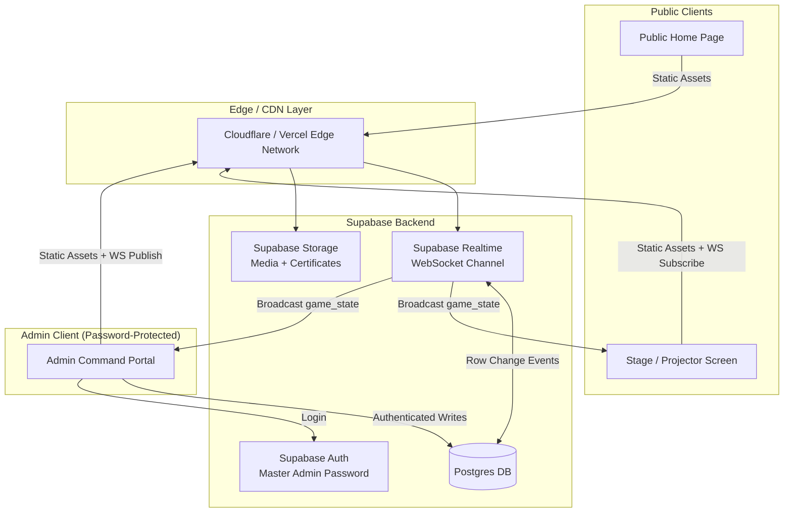
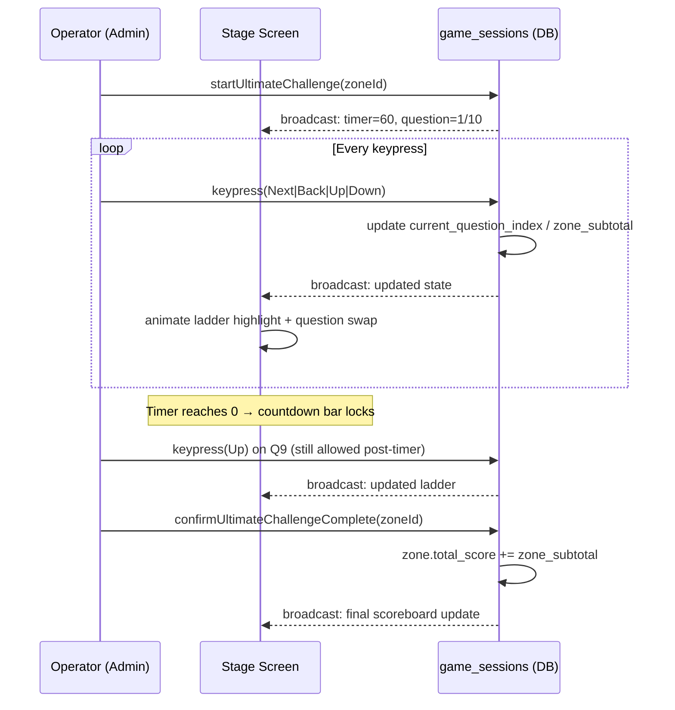
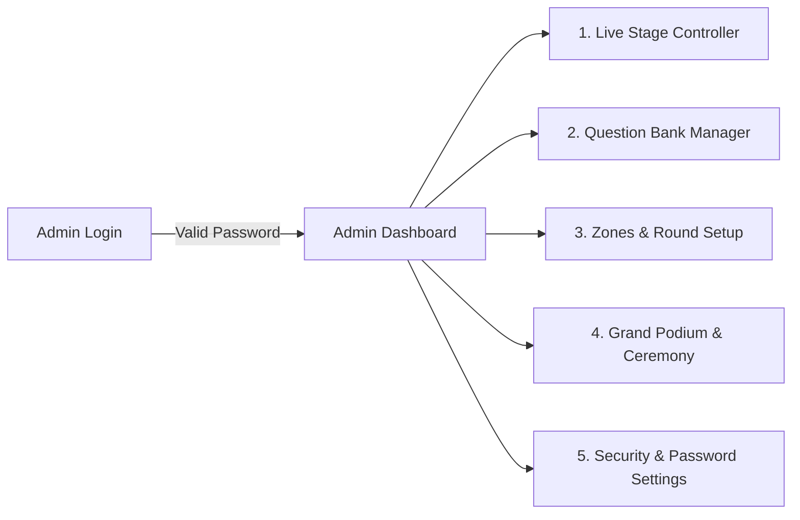
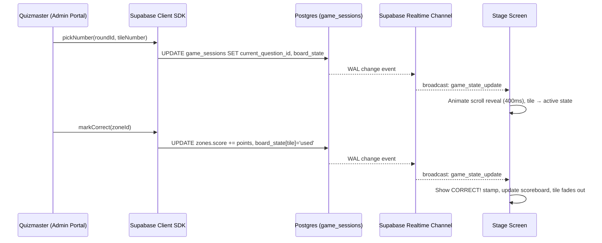
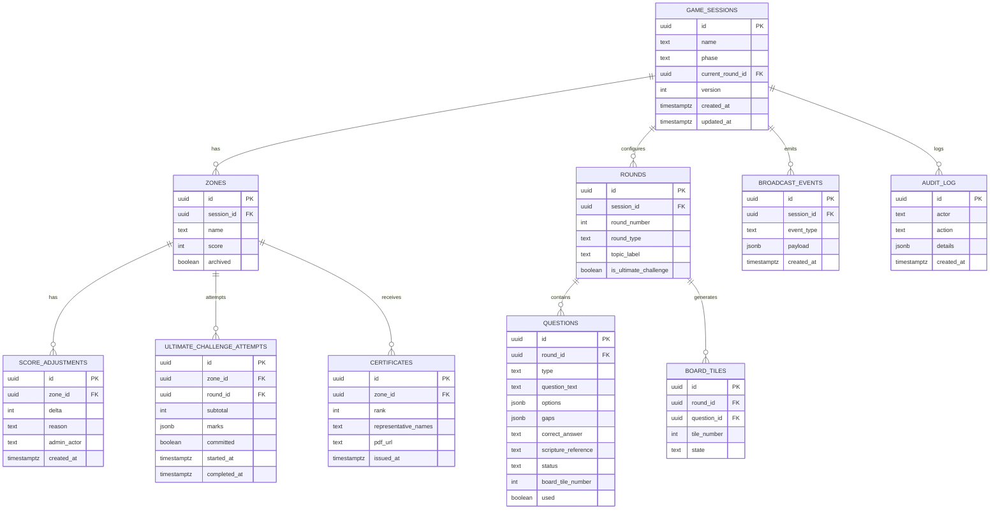
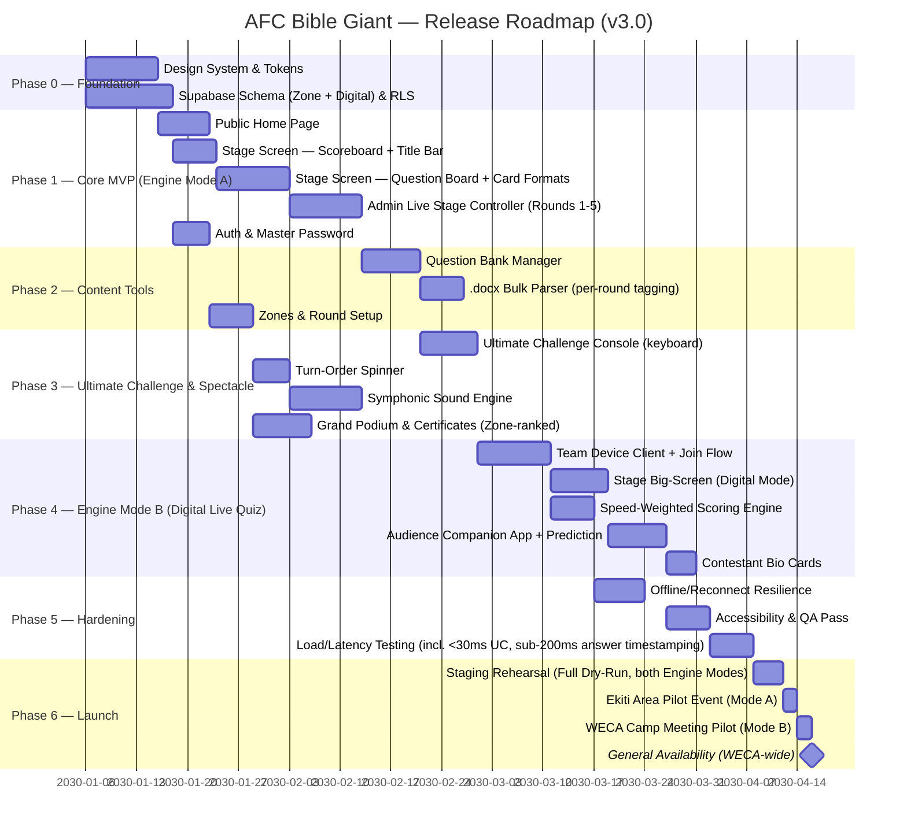

# Product Requirements Document
# "Who Wants to Be a Bible Giant" — AFC Bible Giant
### An Ultra-Luxury 2030 Live Tournament Broadcast Platform

| Field | Value |
|---|---|
| Document Owner | Principal Product Manager & Technical Architect |
| Client Organization | The Apostolic Faith Church (AFM WECA) — Ekiti Area & Youth Development Directorate (YDD) |
| Document Status | Draft v3.1 — Supersedes v1.0/v2.0/v2.1/v3.0; adds Digital Live round formats (simultaneous / tile blitz / ultimate challenge) and dual audience engagement mechanics |
| Classification | Internal / Ministry Use |
| Target Release | 2030-Era Broadcast Standard |

> **v2.0 Change Note:** This revision replaces the individual-contestant/seat scoring architecture from v1.0 with a **Zone (team) scoring model**, a **pick-a-number question board** mechanic, a defined **5-round + Ultimate Challenge** tournament structure, and exact visual/interaction fidelity to the existing AFC Ekiti Area "Bible Giant" broadcast format (reference: 2025 IYC Bible Giant, Ado-Ekiti Area Campmeeting recordings). All sections below reflect this corrected model. Sections largely unchanged from v1.0 (Sound Engine, Security baseline, Deployment) are retained with light edits.

---

## Table of Contents

1. Executive Summary & Product Vision
2. Stakeholders & Personas
3. System Architecture & Dual-Screen Operation
4. Real-Time Synchronization Engine
5. Symphonic Classical Sound Engine
6. Functional Requirements
7. Non-Functional Requirements
8. UI/UX & 2030 Visual Design System
9. Data Schema & API Contracts
10. Security Model
11. Deployment & Release Roadmap
12. Risks, Assumptions & Open Questions
13. Appendices

---

# 1. Executive Summary & Product Vision

## 1.1 Problem Statement

The Apostolic Faith Church's Youth Development Directorate (YDD) runs Bible Giant tournaments at two distinct scales: **Ekiti Area Inter-Zonal Bible Challenges** (Zone HQ: 74 Ajilosun St, Ado-Ekiti) using a well-known manual pick-a-number board format, and **larger WECA-wide Camp Meeting / Area-level competitions** ("Bible Giant Season" events) that already use a more advanced digital, device-based, speed-scored quiz format with live audience participation. Today these run on two disconnected systems with no shared branding, reliability guarantees, or production polish. AFC Bible Giant unifies both into a single platform with two selectable **Engine Modes**, so the same codebase serves an intimate Ekiti Area hall event and a large WECA Camp Meeting broadcast alike.

## 1.2 Vision Statement

> "To give every AFC Ekiti Area youth tournament the polish of a world-class broadcast production, anchored in Scripture, orchestrated in real time, and worthy of the light we carry — *Jesus, The Light of the World* (John 8:12)."

## 1.3 Target Audience & Personas (Summary)

| Persona | Description | Primary Surface |
|---|---|---|
| Quizmaster / Computer Operator (Admin) | YDD-appointed official running the live game from a laptop | Admin Command Portal |
| Zone/Unit Representative(s) | Youth competitors representing a Zone or Area, answering at the board (Mode A) or on a team device (Mode B) | Stage/Projector Screen (Mode A) or Team Device Client (Mode B) |
| Congregational Audience | Church hall attendees watching the projector; in Mode B, may actively participate via phone | Stage/Projector Screen + Audience Companion App (Mode B) |
| Remote/Online Viewer | Youth or family watching via livestream companion view | Public Home Page + read-only stage mirror |
| YDD Zonal/Area Coordinator | Configures Zone/Unit list, uploads question banks, sets Engine Mode per event | Question Bank & Zones module |
| Guest/Visitor | Browses church history/media pre-event | Public Home Page |

## 1.4 Core Value Proposition

1. **Format-faithful modernization** — the app looks and behaves exactly like the tournament format volunteers and congregations already recognize; nothing about the mechanic changes, only the production quality and reliability.
2. **Zero dead-air production** — every number pick, reveal, timer, and score update is automated and synchronized.
3. **Sacred spectacle, not gimmick** — classical/orchestral sound design and gold-on-navy "Celestial" aesthetics befitting a ministry event.
4. **Operational trust** — a single Master Admin Password, auditable question bank, and zone-based scoring built for volunteer-run events.

## 1.5 Success Metrics (KPIs)

| KPI | Target |
|---|---|
| State propagation latency (Admin → Stage) | < 50ms (p95), < 100ms (p99) |
| Quizmaster onboarding time (new volunteer) | < 15 minutes with in-app tour |
| Tournament setup time (zones + question board + rounds) | < 10 minutes |
| Uptime during live event window | 99.9% (local network / offline-first fallback) |
| Question bank bulk import success rate (.docx) | ≥ 98% correctly parsed rows |
| Ultimate Challenge operator input lag (key press → visual mark) | < 30ms |

---

# 2. Stakeholders & Personas

## 2.1 Organizational Context

- **The Apostolic Faith Church (AFC)** — International HQ: Portland, Oregon.
- **AFM WECA** — WECA HQ at Faith City Igbesa / Anthony Village, Lagos.
- **Apostolic Faith Church Ekiti Area** — Area HQ: 74 Ajilosun St, Ado-Ekiti, Ekiti State, Nigeria. **This Area name/branding must appear in the app UI itself** (footer/header of the Public Home Page and the Stage Screen), not merely in recording titles.
- **Youth Development Directorate (YDD)** — the commissioning body; slogan (canonical wording, confirmed): *"Raising & retaining an Army of Outstanding Youth going to Heaven & persuading others to come along."*

## 2.2 Emblems & Mottoes (Brand Canon — must appear in UI copy/footer, never altered)

| Motto/Emblem | Scripture Reference | Usage |
|---|---|---|
| "Jesus, The Light of the World" | John 8:12 | Home page hero, splash/loading screens |
| "Africa for Christ" | Mark 16:15 | Footer, About/History section |
| YDD Slogan | *"Raising & retaining an Army of Outstanding Youth going to Heaven & persuading others to come along."* | Stage Screen footer banner (blue bar, exactly as legacy format), About section |
| "Apostolic Faith Church Ekiti Area" | — | Stage Screen header/corner badge, Home page footer, Certificates |

## 2.3 Detailed User Personas

### Persona A — Quizmaster / Computer Operator ("Bro. Samuel", YDD Zonal Coordinator)
- Runs the tournament solo from a laptop: reveals questions from the pick-a-number board, judges German (fill-in-the-gap) and Round 5 (open, no options) answers live, and operates the Ultimate Challenge via keyboard (Next/Back, Up/Down).
- Needs every action to be reversible and logged (score adjustments, mark removal via Down key).

### Persona B — Zone Representative ("Sister Faith", representing Ikere Zone)
- Comes forward to answer when their Zone is called or when their Zone picks a number; sees only the Stage Screen.
- No individual score is tracked for her personally — all points accrue to her Zone's total.

### Persona C — Congregational Audience Member
- Watches the zone scoreboard, the parchment question card, and the number board from the pews; needs large fonts, high contrast, and reverent-but-exciting audio cues.

### Persona D — YDD Zonal/Area Coordinator
- Pre-loads the Zone list per event (Zone names vary per event — e.g., "IDO, IGEDE, EMURE, ADO, IJERO" for one event vs. "IKERE, IGEDE, ADO, IDO, IKOLE, EMURE" for another).
- Uploads question banks per round/topic (e.g., "Genesis Book" for Rounds 1–5, "Book of Daniel Section One" for a different event).

---

# 3. System Architecture & Dual-Screen Operation

## 3.1 High-Level Architecture



## 3.2 The Three Application Surfaces

### 3.2.1 Public Home Page (`/`)

Unchanged from v1.0 concept — Hero, "Faith in Frames" gallery with lightbox, History & Emblems, dual launch CTAs ("Enter the Arena" / "Quizmaster Portal"). **Addition:** footer now explicitly displays "Apostolic Faith Church Ekiti Area, 74 Ajilosun St, Ado-Ekiti" alongside WECA and International HQ addresses.

### 3.2.2 Public Stage / Projector Screen (`/stage`)

This screen is rebuilt to be **pixel-faithful to the existing legacy format**, upgraded only in rendering quality, animation polish, and real-time reliability.

#### 3.2.2.1 Persistent Layout Zones

| Zone | Position | Content |
|---|---|---|
| Zone Scoreboard Row | Top, full width | One box per Zone: Zone name (header) + running score (body); 2–8 zones supported, configured per event |
| Title Bar | Below scoreboard | Line 1: *"Inter-Zonal Bible Challenge on '[Book/Topic Name]'"* (admin-configurable per session). Line 2: *"Round N"* or *"Round N (Ultimate Challenge)"* |
| Main Stage Area | Center | The parchment/scroll graphic — renders the active question, the "CORRECT!"/"INCORRECT" stamp, or (during Ultimate Challenge) is replaced by the timer bar + point ladder |
| Left Number Board | Left, standard rounds only | Grid of question-pick tiles (dynamically sized to the round's question count, e.g., 1–15 of a 30-question round split left/right) |
| Right Number Board | Right, standard rounds only | Continuation of the number-pick grid |
| Footer Banner | Bottom, full width (blue bar) | YDD slogan: *"Raising & retaining an Army of Outstanding Youth going to Heaven & persuading others to come along"* + "Apostolic Faith Church Ekiti Area" badge |

#### 3.2.2.2 Standard Round Behavior (Rounds 1–3, 5)

1. Scroll graphic starts blank/idle between questions.
2. Admin picks a number from the board (on behalf of the Zone whose turn it is, or as called live) → the scroll animates in with the question text.
3. Question card format depends on round type (Section 3.2.2.4).
4. On judgment (Admin marks correct/incorrect), the scroll displays a **"CORRECT!"** (green, stamp animation, matches legacy exactly) or **"INCORRECT"** (crimson equivalent) overlay; the corresponding Zone's scoreboard number increments.
5. The picked number tile transitions: **active (highlighted) → used (greyed/checked) → removed from the board**, per the confirmed legacy behavior (a brief "used" state is shown before the tile disappears, never an instant vanish).
6. Scroll clears, board remains ready for the next pick.

#### 3.2.2.3 Round Numbering & Format Reference Table

| Round | Question Type | Options Shown? | Board Mechanic |
|---|---|---|---|
| Round 1 | Objective | Yes — bracketed list `[Option A \| Option B \| Option C \| Option D]` | Pick-a-number board |
| Round 2 | Objective | Yes — bracketed list | Pick-a-number board |
| Round 3 | Objective | Yes — bracketed list | Pick-a-number board |
| Round 4 | German (fill-in-the-gap) | Yes — sentence with blanks (`____`) displayed, word bank shown in brackets below | Pick-a-number board |
| Round 5 | Theory / Open | **No options shown** — question only, judged live by Quizmaster | Pick-a-number board |
| Ultimate Challenge (final segment) | Mixed (operator's discretion) | Varies | **Not** a number board — see 3.2.2.5 |

> Question count per round is **not fixed at 16** — it depends on how many questions were uploaded for that round (legacy recordings show 16-tile boards; typical target is up to 30). The number board layout must dynamically size itself (e.g., wrap into additional rows/columns) to fit however many questions exist for the active round, split evenly across the left and right boards.

#### 3.2.2.4 Question Card Formats

**Objective (Rounds 1–3):**
```
Who was Isaac's favorite son? (25:28)
─────────────────────────────────
[Jacob | Esau | Joseph | Reuben]
```

**German / Fill-in-the-Gap (Round 4):**
```
And ____ said to the ____ and ____ of the ____.
─────────────────────────────────
[magicians | Chaldeans | Nebuchadnezzar | sorcerers]
```

**Round 5 (Theory/Open — no bracket list):**
```
What did Jacob do at his birth? (25:26)
```
*(Quizmaster judges the spoken/written answer live and marks correct/incorrect manually — no options render on screen.)*

#### 3.2.2.5 Ultimate Challenge — Special Mechanic

The Ultimate Challenge is a **final bonus segment run once per Zone, one Zone at a time** (each Zone gets its own fresh attempt, not simultaneous play):

1. Admin selects/calls up the next Zone to attempt the Ultimate Challenge.
2. A 60-second countdown bar (vertical, left side, matching legacy) starts **immediately** when the round begins for that Zone.
3. **10 questions**, drawn from that round's uploaded bank, are displayed **one at a time** in the center scroll area — no options/bracket list required (format at Admin's discretion, but typically plain question text).
4. The Admin/Operator navigates via keyboard:
   - **→ (Next) / ← (Back)** — move forward/backward between the 10 questions.
   - **↑ (Up)** — mark the currently displayed question correct; adds **5 points flat** (regardless of question) to the active Zone's Ultimate Challenge subtotal.
   - **↓ (Down)** — remove/undo a mark on the currently displayed question, subtracting 5 points.
5. The **point ladder** (right side, values 5–50 in steps of 5) visually highlights the Zone's current running Ultimate Challenge subtotal as Up/Down are pressed — it is a **live score indicator**, not a wager board.
6. **When the 60-second timer expires, the countdown stops and locks** (no further countdown), but **the Operator may continue pressing Next/Back/Up/Down on questions already displayed** to finalize marking — input is not blocked by timer expiry.
7. Once the Operator confirms the Zone's attempt is complete, the Ultimate Challenge subtotal is added to that Zone's overall tournament score, and the next Zone's attempt begins (fresh 60-second timer, fresh set of 10 questions or the same set — Admin configurable).



**User Story 3.2.2.5-A**
> As the Operator, I want to control the Ultimate Challenge entirely via keyboard (Next/Back/Up/Down), so that I can keep pace with a fast 60-second round without touching the mouse.

*Acceptance Criteria:*
- [ ] Arrow-key handlers are active only while the Ultimate Challenge module has focus, to avoid accidental triggers elsewhere in the Admin Portal.
- [ ] Up/Down key presses reflect on the Stage Screen ladder within 30ms.
- [ ] Timer expiry visually locks the countdown bar (e.g., freezes at 0, subtle red state) but does **not** disable Next/Back/Up/Down.
- [ ] Each Zone's Ultimate Challenge attempt is stored as a discrete record (Section 9) so subtotals are auditable per Zone.
- [ ] A confirmation step is required before the subtotal commits to the Zone's overall score (prevents accidental double-add).

#### 3.2.2.6 Turn-Order Spinner — "Who Plays First?"

Reference: dark-theme broadcast overlay showing a segmented color wheel (one segment per competing unit) spun to reveal the answering/play order for a round, alongside a live-building "Drawing Order" list (1st, 2nd, 3rd...).

1. Before a round begins (Admin-triggered, optional per round — not every round needs a fresh draw), the Stage Screen can switch to a **full-screen Spinner Overlay**, replacing the standard round layout temporarily.
2. Header reads *"Round N — Who Plays First?"* in the gold-on-dark 2030 style (this overlay uses the darker/higher-contrast "night mode" variant of the design system — pure black/near-black background, gold small-caps label, bold white title — distinct from the lighter parchment-scroll look used for questions).
3. A circular wheel is divided into equal segments, one per competing unit currently configured for the session (Zone or Area — see 3.2.2.7), each segment colored distinctly and labeled with the unit's name.
4. Admin triggers **Spin**; the wheel animates a multi-rotation spin-and-decelerate (3–6s), landing on a segment via a fixed pointer at top.
5. The landed unit is appended to the **Drawing Order** panel (right side) as the next open slot (1st, 2nd, 3rd, ... up to the total number of units).
6. That unit's wheel segment is removed (or disabled) so it cannot be drawn again, and the Admin repeats **Spin** until all units have a slot filled.
7. Once the full order is drawn, Admin confirms and the Stage Screen transitions back to the standard round layout; the drawn order determines the **question-pick sequence** for that round (which unit picks the next board tile, in the drawn order, cycling until the round's questions are exhausted).
8. The drawn order is stored and viewable by the Admin for the remainder of the round; it does **not** carry over automatically to the next round unless the Admin explicitly re-uses it.

> Emoji/reaction overlays visible at the bottom of the reference screenshot are assumed to originate from the live-streaming platform (e.g., Facebook/YouTube Live chat reactions) used to broadcast the event externally, **not** a feature of AFC Bible Giant itself. Confirm before build if in-app reactions are actually wanted.

**User Story 3.2.2.6-A**
> As the Operator, I want to spin a wheel to fairly and dramatically determine which Zone/Area answers first each round, so that turn order feels transparent and exciting rather than arbitrarily assigned.

*Acceptance Criteria:*
- [ ] Wheel segment count always equals the number of active (non-archived) competing units in the session.
- [ ] Spin outcome is determined server-side (weighted-random, uniform across remaining units) before the animation plays, so the Stage Screen's spin-and-land animation is purely presentational and cannot desync between Admin and Stage.
- [ ] Each unit can only be drawn once per spin sequence; the wheel visually shrinks/removes filled segments after each draw.
- [ ] The full drawn order is broadcast to Stage and persisted (Section 9) so it survives a reconnect.
- [ ] Admin can re-trigger the full draw sequence for a round (with confirmation) if needed, discarding the previous order.

#### 3.2.2.7 Multi-Tier Event Support (Zone-Level vs. Area-Level)

Confirmed: AFC Bible Giant must support **two event tiers**, differing only in the label and typical scale of the competing units, not in game mechanics:

| Tier | Competing Unit Label | Example Units |
|---|---|---|
| Zone-Level (Ekiti Area Inter-Zonal) | "Zone" | Ido, Igede, Emure, Ado, Ijero, Ikere, Ikole |
| Area-Level (WECA Inter-Area) | "Area" | Ogun Central, Lagos Central, Ekiti, Enugu, Rivers |

The underlying data model (Section 9) treats both as the same `competing_units` entity; the session simply carries a configurable `unit_label` (defaults to "Zone") used throughout the UI (scoreboard headers, Title Bar language, certificates, wheel segments) so the same codebase serves both an Ekiti Area inter-zonal event and a larger WECA inter-area event without code changes — only setup-time configuration.

### 3.2.3 Password-Protected Admin Command Portal (`/admin/*`)



#### Module 1 — Live Stage Controller (Rebuilt)

| Feature | Description |
|---|---|
| Round Selector | Choose active round (1–5) or launch the Ultimate Challenge segment; sets the Title Bar topic/book label |
| Turn-Order Spinner Trigger | Launches the full-screen "Who Plays First?" spinner overlay (Section 3.2.2.6) for the active round; shows live draw progress |
| Question Board | Mirrors the Stage Screen's number grid; clicking a number here reveals that question on Stage; visually marks tiles active → used → removed, synced with Stage |
| Judgment Controls | "Mark Correct" / "Mark Incorrect" buttons — attributes the point to the currently active Zone; triggers CORRECT!/INCORRECT stamp on Stage |
| Zone/Unit Turn Indicator | Shows which competing unit is currently "up," following the drawn order if one was spun; Admin can override manually |
| Ultimate Challenge Console | Dedicated keyboard-driven sub-panel (Section 3.2.2.5): zone selector, 60s timer start/reset, question 1–10 navigator, live subtotal display, confirm-and-commit button |
| Soundboard Triggers | One-tap buttons: Suspense Drone, Correct Chime, Incorrect Buzz, Fanfare, Applause, Metronome Tick |
| Score Adjustment | Manual +/- point adjustment per Zone with mandatory reason note (audit log) |

**User Story 3.2.3-M1-A**
> As the Operator, I want to pick a question number and have it instantly appear on the projector with the correct format for that round's question type, so that gameplay never stalls.

*Acceptance Criteria:*
- [ ] Selecting a number tile broadcasts the reveal to Stage within 50ms.
- [ ] The rendered question card format (Objective bracket-list / German fill-in-gap / Round 5 no-options) is automatically determined by the round's configured type — Operator does not need to manually choose a template.
- [ ] Used tiles cannot be re-selected (disabled state) unless the Operator explicitly resets the round.

#### Module 2 — Question Bank Manager

| Feature | Description |
|---|---|
| CRUD Operations | Create/Read/Update/Delete questions; soft-delete with restore |
| Round Assignment | Each question is tagged to a specific Round (1–5) or to the Ultimate Challenge pool, plus a Topic/Book label (e.g., "Genesis Book") |
| Question Types | **Objective** (bracketed 4-option list), **German** (fill-in-the-gap with word bank), **Theory/Open** (no options, live-judged) |
| .docx Bulk Question Parser | Upload a `.docx` file per the documented template (Appendix 13.3); system parses questions, gap placeholders, word banks, and correct answers into the bank, tagged by round |
| Validation & Error Report | Post-parse report listing successfully imported rows and flagged/failed rows with reasons |
| Board Sizing | System automatically computes the number-board size for a round from however many questions are tagged to it (no fixed count) |

#### Module 3 — Zones & Round Setup (renamed from "Contestants & Zones Setup")

| Feature | Description |
|---|---|
| Zone Roster | Add/edit/remove Zones for the event (2–8 zones, free-text names per event, e.g., "Ido," "Igede," "Emure," "Ado," "Ijero," "Ikere," "Ikole") |
| Zone Score Reset | Reset all Zone scores to 0 for a new tournament while preserving the Zone list |
| Score Adjustments | Manual +/- point adjustment per Zone with mandatory reason (audit-logged) |
| Round Reset | Reset a specific round's question-board "used" state (re-enables all tiles) without affecting other rounds' progress |
| Topic/Book Label | Set the Title Bar's book/topic string per round (e.g., "Genesis Book," "Book of Daniel Section One") |

> **Note:** Individual contestant seat allocation from v1.0 is removed entirely. Scoring, turn-tracking, and all state is Zone-level only, per confirmed requirements.

#### Module 4 — Grand Podium & Ceremony

Unchanged from v1.0, except ranking is now by **Zone** (not individual contestant), and Certificates of Scriptural Mastery are issued **per Zone** (or per named Zone representative(s) entered manually by the Operator at ceremony time, since individual participation isn't tracked in-game).

#### Module 5 — Security & Password Settings

Unchanged from v1.0 — Master Admin Password management, session management, audit log viewer.

---

## 3.3 Engine Mode B — Digital Live Quiz ("APOQUIZ-style", WECA Camp Meeting / Area-Level Events)

> **Confirmed scope:** AFC Bible Giant supports **two distinct Engine Modes**, chosen per event at session setup. They share the Zone/Unit scoreboard, branding, and sound-engine concepts but use **entirely different play mechanics**:
>
> | | Engine Mode A — Legacy Board | Engine Mode B — Digital Live Quiz |
> |---|---|---|
> | Typical use | Ekiti Area Inter-Zonal Bible Challenge | WECA Camp Meeting / Area-level ("Bible Giant Season" events) |
> | Answer input | Operator picks a number, judges live | Each team answers on **their own device** (laptop/tablet at their podium) |
> | Scoring | Fixed points, Operator-judged | **Automatic, speed-weighted** — earlier correct answers score higher |
> | Audience role | Passive viewer | **Active participant** — joins via QR/session code, can submit an "Audience Prediction" ranking |
> | Question types | Objective / German gap-fill / Theory-open | Objective (A/B/C/D) only, timed |

A `game_sessions.engine_mode` field (`legacy_board` \| `digital_live`) determines which of Section 3.2 or this Section 3.3 the Stage Screen and Admin Portal render for that event.

### 3.3.1 New Application Surfaces for Digital Live Quiz

Engine Mode B introduces **two additional client surfaces** beyond the three in Section 3.2:

| Surface | Route | Purpose |
|---|---|---|
| Team Device Client | `/play?session={code}` | Used on each competing unit's own laptop/tablet at their podium; join with session code, view question + answer buttons, submit before the timer ends |
| Audience Companion App | `/join?session={code}&role=audience` (QR-scannable) | Used on individual audience members' phones; join with name, answer the same live trivia questions as the teams, and optionally submit a separate team-ranking prediction when prompted |

### 3.3.2 Round Formats

Confirmed: a Digital Live Quiz event runs through **three distinct round formats** across its rounds, each round tagged with a `round_format`:

| Format | Typical Rounds | Mechanic |
|---|---|---|
| `simultaneous` | Rounds 1–2 | All units (and the audience) see and answer the **same question at the same time**; speed-weighted scoring (Section 3.3.4) |
| `tile_blitz` | Rounds 3–4 | Turn order set by the Turn-Order Spinner (Section 3.2.2.6, reused here); each unit takes a **private turn** picking a numbered tile that reveals a question only for them | 
| `ultimate_challenge` | Round 5 | Each unit takes a **sequential 60-second, 10-question turn**, same structure as the Legacy Board's Ultimate Challenge (Section 3.2.2.5) |

Each competing unit fields **two named players** per round (e.g., Ekiti: Okunola, Adenigba), shown as paired avatar badges under the unit's shield icon on round-intro screens (Section 3.3.3). Player names are informational/roster detail only — scoring remains at the unit level.

### 3.3.3 Stage/Big-Screen Flow — Digital Mode

#### Pre-Session: Join Screen

- Full-screen dark "night mode" panel (matches Turn-Order Spinner's dark theme, Section 3.2.2.6) showing:
  - **APOQUIZ-style wordmark** (product name TBD — see Open Questions) + tagline, e.g. "Live Bible Quiz Platform."
  - Large **Session Code** display (e.g., `345TWJ`) for teams to type into their device.
  - **QR code** + URL (`{domain}/join?session={code}`) for audience to scan.
  - Live counters: **"N teams ready"** and **"N audience"** connected, updating in real time.
  - A roster strip at the bottom listing each competing unit with a connection status dot (Connected/Waiting), colored per unit.

#### Round Intro Screen

- Shown at the start of each round: **"Now Starting — Round N"** with each competing unit rendered as a colored shield icon, unit name, and its two named players (small circular avatar badges with initials) beneath, ending with a "GET READY..." cue before the round's first question.

#### Category Divider Slide

- A full-screen branded interstitial shown between topical question blocks within a round (e.g., "The Gospels — Matthew, Mark, Luke, and John"), on the church's blue WECA theme with AFC/YDD/"Africa for Christ" logos and an open-Bible graphic. Purely presentational — signals a topic shift to the audience without affecting game state.

#### Question Screen (`simultaneous` format)

- Question index indicator top-left (`3 / 15`).
- **Countdown timer bar**, top, full width: numeric seconds-remaining readout at the right end. Color moves through **three stages** — blue (plenty of time) → orange (mid-range warning) → red (final seconds) — not a simple two-stage blue→red.
- Question text, bold, large, left-aligned on a near-black background (not the parchment scroll — this mode uses the pure dark 2030 theme throughout).
- Four full-width answer rows (A/B/C/D), dark glass cards; **no options are pre-marked** — this is what each team's device (and the audience's device) also shows for them to tap.
- A small **live answer-progress indicator** (colored dot per unit, e.g., "0/5 answered", turning to "✓ All answered" once every unit has submitted) showing which units have submitted, without revealing what they chose.
- Small picture-in-picture panel (bottom-right) optionally showing the live camera feed of the physical stage, for remote/livestream viewers.

#### Question Screen (`tile_blitz` format) — "Choose a Tile"

1. The Turn-Order Spinner (Section 3.2.2.6) runs once at the start of the round to set the unit sequence.
2. On a unit's turn, the Stage Screen shows **"TILE BLITZ — [Unit Name] — Choose a Tile"** with a turn counter (e.g., `1 / 25`) and a grid of numbered tiles (dynamically sized to the round's question count, same sizing rule as the Legacy board, Section 3.2.2.3).
3. That unit's Team Device Client is the only one prompted to pick a tile; other units' devices show a waiting state.
4. Once picked, the tile's question appears full-screen with a header **"[Unit Name] is answering"** and the same three-stage countdown bar; only that unit may answer (their device shows the A/B/C/D buttons; other devices remain in waiting state). The Audience Companion App may still answer along, per the confirmed "audience answers whenever a question is shown" behavior.
5. A persistent footer strip shows every unit's live cumulative score, updating after each tile is resolved.
6. The picked tile is marked used (matching the Legacy board's active → used → removed treatment, Section 3.2.2.2) and control passes to the next unit in the drawn order.

#### Digital Ultimate Challenge (Round 5)

Mirrors the Legacy Board's Ultimate Challenge (Section 3.2.2.5) mechanically, run on the Digital engine:

1. **One unit at a time** (confirmed) — each unit gets its own sequential 60-second, 10-question turn; not simultaneous.
2. The unit's Team Device Client displays each of its 10 questions in sequence with A/B/C/D buttons; the Stage Screen mirrors the countdown bar and question index (`Question 6 of 10`) for the audience.
3. Unlike the manual keyboard-driven Legacy Ultimate Challenge, scoring here is **automatic**: each correct tap is scored (flat points per question, matching the Legacy engine's 5-points-per-question structure scaled to this engine's point range — exact value confirmed during Phase 4 rehearsal, Section 11).
4. As in the Legacy version, the 60-second timer locks at zero but does not block the unit from finishing answers already displayed.
5. Once a unit's 10 questions are resolved, their subtotal commits to the overall score and the next unit's turn begins.

#### Correct-Answer Reveal Screen

- Correct answer name shown in a large green badge under a "CORRECT ANSWER" label, with the original question text beneath it.
- One card per competing unit, colored by their assigned color, showing:
  - The unit's submitted answer text (in quotes), or an empty/dash state if the unit didn't answer that question (e.g., in `tile_blitz`, only the active unit has a card populated — others may show dimmed/not-applicable).
  - A green check (correct) or red cross (incorrect) icon.
  - Points earned this question (e.g., `+800 pts`), or no points badge shown if incorrect/no-answer.
- Cards for units that answered correctly are highlighted (green border/glow); incorrect units are dimmed/red-bordered.

#### Round Results Screen

- Shown at the end of each round: **"Round N Results"** with each unit's cumulative score as a ranked horizontal bar (medal icons for 1st–3rd, plain rank number for 4th+), plus a docked **Audience Predictions** panel (Section 3.3.5) showing that round's "got it right" percentage.

#### Live Leaderboard Ticker

- A persistent bottom ticker bar (visible between/under question screens) showing all units ranked with rank number, name, and cumulative score, updating after every question (e.g., `#1 Ekiti 6456  #2 Lagos Central 6204  #3 Rivers 5412 ...`).

### 3.3.4 Scoring Formula — Speed-Weighted

Points for a correct answer scale down the later the team (or audience member) answers within the time window; incorrect or unanswered = 0.

```
points_awarded = 0                                          if incorrect or unanswered
points_awarded = round(
  MIN_CORRECT_POINTS +
  (MAX_CORRECT_POINTS - MIN_CORRECT_POINTS) *
  (1 - (time_taken_ms / question_time_limit_ms))
)                                                             if correct
```

Defaults: `MAX_CORRECT_POINTS = 1000`, `MIN_CORRECT_POINTS = 300` (a correct answer always earns at least this floor, even at the very last moment, to avoid discouraging attempts), `question_time_limit_ms` configurable per question (default 20000ms). These defaults approximate the score spread seen in reference footage (e.g., 800/751/409/363/0 across a single question) and should be tuned during rehearsal (Section 11). The same formula applies to audience scoring (Section 3.3.5), independently from unit scoring.

### 3.3.5 Audience Engagement — Two Distinct Mechanics

Confirmed: the Audience Companion App supports **two separate, independently-triggered features**. They must not be merged in implementation.

#### 3.3.5.1 Audience Trivia Participation & Leaderboard

- Whenever a question is shown to the competing units (in any round format), the Audience Companion App shows the **same question** simultaneously, and each audience member answers it themselves.
- Audience answers are scored with the same speed-weighted formula (Section 3.3.4), independently of unit scores — an audience member's score never affects any unit's score.
- A running **Audience Leaderboard** ranks individual audience participants; the Round Results screen (Section 3.3.3) shows a docked "Audience Predictions — just for fun" widget with that round's aggregate accuracy (e.g., "44% — 1055/2382 got it right") and a live-updating mini "Top Audience" list.
- A dedicated **Audience Leaderboard screen** (Admin-triggered, typically at round end) shows: two joint "Audience Champion" crowns for the top scorer(s), then a ranked, two-column list of the next-highest scorers with name, region/last-4-digits identifier, and points — labeled **"Round N — Rewards to the Top 100."**

**User Story 3.3.5.1-A**
> As an Audience member, I want to answer the same trivia questions as the teams on my phone, so that I can compete for my own recognition, not just watch.

*Acceptance Criteria:*
- [ ] Audience answer submission uses the same server-authoritative timestamping as team answers (Section 9).
- [ ] The Audience Leaderboard is scoped per session and resets only when the Admin starts a new session.
- [ ] Audience identifiers shown on the leaderboard are partially masked (e.g., last 4 digits of a phone number) for privacy — never a full phone number.
- [ ] Audience scoring never writes to or influences any `zones`/unit score.

#### 3.3.5.2 Team-Ranking Prediction ("Who's Winning?")

A separate, Admin-triggered full-screen mode: **"How does the audience rank the teams?"** — unchanged from the prior spec (weighted 1st=N pts...last=1pt ranking of all units, "LIKELY LEADER" badge, votes-cast/audience-connected counters). This is a lower-frequency, meta-engagement feature distinct from 3.3.5.1 and does not require the audience to know any Bible content — it's a prediction about the competition itself.

*Acceptance Criteria (unchanged):*
- [ ] Each audience participant may submit or update their ranking until the Admin closes the prediction window.
- [ ] Weighted totals recompute live as votes come in (<500ms visible update).
- [ ] Results are never written to the official `zones`/units score — stored separately (Section 9).

### 3.3.6 Contestant Introduction Card

A pre-round "Meet the Contestant" display (Admin-triggered, optional), showing an individual representative's profile: name, age, Christian experience(s), branch/local assembly, school, future ambition, Christian ambition, personal life-verse/philosophy quote. This is presentational only (no scoring impact) and is stored per competing unit as an optional roster detail (Section 9).

### 3.3.7 Admin Portal Additions for Digital Live Quiz

| Feature | Description |
|---|---|
| Engine Mode Selector | Set at session creation: `legacy_board` or `digital_live`; determines which Stage/Admin experience loads |
| Session Code Generator | Auto-generates a short join code (e.g., `345TWJ`) and QR code per session |
| Round Format Selector | Per round: `simultaneous`, `tile_blitz`, or `ultimate_challenge` |
| Team Roster & Bios | For digital sessions: add competing units, their two named players per round, and optionally attach a contestant bio card (Section 3.3.6) |
| Question Timer Config | Per-question (or per-round default) time limit in seconds, feeding the scoring formula |
| Live Monitor | Real-time view of join status (teams ready / audience count), per-question answer submission progress, without revealing answers before lock |
| Audience Trivia Toggle | Enable/disable audience trivia participation for a session (Section 3.3.5.1) |
| Audience Prediction Trigger | Open/close the team-ranking prediction window (Section 3.3.5.2) |

---

# 4. Real-Time Synchronization Engine

Unchanged in principle from v1.0 (Supabase Realtime, `game_sessions` single source of truth, <50ms propagation target). Key addition: the Ultimate Challenge's per-keypress updates (Section 3.2.2.5) share the same `session:{id}:state` channel and must meet a tighter **<30ms** operator-input-to-render target given its rapid-fire nature. **Digital Live Quiz mode** additionally requires sub-200ms answer-submission timestamping accuracy across all team devices (Section 9), since submission order directly determines score — server-side receipt time, not client-reported time, is authoritative.

## 4.1 Synchronization Flow (Standard Round)



## 4.2 Reliability, Offline & Conflict Handling

Unchanged from v1.0 (Section 4.4–4.5 concepts retained): auto-reconnect with full snapshot fetch, idempotent action IDs, offline admin action queue via IndexedDB, optimistic-concurrency `version` column on `game_sessions` and `zones`.

---

# 5. Symphonic Classical Sound Engine

Unchanged from v1.0 — see cue catalog, `SoundEngine` TypeScript interface, and functional requirements (SND-01 through SND-05). One addition:

| Cue | Trigger |
|---|---|
| Ultimate Challenge Tick | Rapid metronome-style tick during the 60-second countdown, tempo fixed (not timer-linked like the suspense drone, since this is an active-answering round, not a pre-answer suspense beat) |
| Timer Lock Thud | Single low percussive hit when the 60-second countdown reaches 0 and locks |

---

# 6. Functional Requirements

## 6.1 Functional Requirement Summary Table

| ID | Module | Requirement | Priority |
|---|---|---|---|
| FR-01 | Public Home | Render hero, gallery, history, dual CTAs, Ekiti Area branding footer | P0 |
| FR-02 | Public Home | Lightbox gallery with keyboard/swipe nav | P1 |
| FR-03 | Stage Screen | Render Zone Scoreboard Row (2–8 zones, configurable) | P0 |
| FR-04 | Stage Screen | Render Title Bar with topic/book + Round N label | P0 |
| FR-05 | Stage Screen | Render parchment/scroll question card in 3 formats (Objective / German gap-fill / Theory-open) | P0 |
| FR-06 | Stage Screen | Render dynamic-size number board (left/right), active→used→removed tile states | P0 |
| FR-07 | Stage Screen | Render CORRECT!/INCORRECT stamp overlay | P0 |
| FR-08 | Stage Screen | Render Ultimate Challenge mode: 60s countdown bar + point ladder, replacing number boards | P0 |
| FR-09 | Stage Screen | Render Grand Podium ceremony sequence (Zone ranking) | P0 |
| FR-10 | Admin | Master password login with lockout after 5 failed attempts | P0 |
| FR-11 | Admin — Live Stage Controller | Round selector, mirrored question board, judgment controls, Zone turn indicator | P0 |
| FR-12 | Admin — Live Stage Controller | Ultimate Challenge keyboard console (Next/Back/Up/Down) with <30ms sync | P0 |
| FR-13 | Admin — Live Stage Controller | Soundboard triggers | P1 |
| FR-14 | Admin — Question Bank | CRUD questions across 3 types, tagged to Round + Topic | P0 |
| FR-15 | Admin — Question Bank | `.docx` bulk parser with dry-run preview, auto board-sizing | P0 |
| FR-16 | Admin — Zones & Round Setup | Zone roster CRUD (free-text names, 2–8 zones) | P0 |
| FR-17 | Admin — Zones & Round Setup | Score adjustment with audit reason | P0 |
| FR-18 | Admin — Zones & Round Setup | Per-round board reset (independent of other rounds) | P1 |
| FR-19 | Admin — Grand Podium | Ranked Zone reveal with fanfare | P0 |
| FR-20 | Admin — Grand Podium | Certificate PDF generation (per Zone / per named representative) | P0 |
| FR-21 | Admin — Security | Change Master Admin Password | P0 |
| FR-22 | Admin — Security | View audit log | P1 |
| FR-23 | System | Realtime state sync across all clients | P0 |
| FR-24 | System | Offline action queueing on Admin | P2 |
| FR-25 | System | Engine Mode selector (`legacy_board` \| `digital_live`) per session | P0 |
| FR-26 | Digital Live — Team Device | Join via session code, view timed question, submit one answer per question | P0 |
| FR-27 | Digital Live — Stage Screen | Session code + QR join screen with live team/audience counters | P0 |
| FR-28 | Digital Live — Stage Screen | Countdown-timed question display, answer-progress dots, correct-answer reveal with per-unit points | P0 |
| FR-29 | Digital Live — Scoring | Server-timestamped speed-weighted scoring (Section 3.3.3) | P0 |
| FR-30 | Digital Live — Audience | QR/code join, Audience Trivia Participation (scored independently) and separate team-ranking Prediction with weighted live results | P0 |
| FR-31 | Digital Live — Admin | Contestant bio card management and display trigger | P1 |
| FR-32 | Digital Live — Rounds 1–2 | `simultaneous` format: all units + audience answer the same question at once | P0 |
| FR-33 | Digital Live — Rounds 3–4 | `tile_blitz` format: spinner-ordered turns, private per-unit tile pick and question | P0 |
| FR-34 | Digital Live — Round 5 | `ultimate_challenge` format: sequential per-unit 60s/10-question turns, auto-scored | P0 |

## 6.2 Detailed User Stories & Acceptance Criteria (Selected Critical Paths)

### FR-06 — Dynamic Number Board

**User Story**
> As the Operator, I want the question-pick board to automatically fit however many questions I uploaded for a round (not a fixed 16), so that I don't have to manually configure board layout per event.

**Acceptance Criteria**
- [ ] Board tile count = count of `published` questions tagged to the active round.
- [ ] Tiles are split as evenly as possible between the left and right boards.
- [ ] Board reflows into additional rows if the question count exceeds a single row's capacity, without shrinking text below the legibility floor (Section 7.4).
- [ ] A "used" tile shows a distinct greyed/checked visual state for a brief transition (≥400ms) before being removed from the board.

### FR-08 / FR-12 — Ultimate Challenge

See full mechanic and acceptance criteria in Section 3.2.2.5.

### FR-16 — Zone Roster

**User Story**
> As the Zonal/Area Coordinator, I want to define the Zone list fresh for each event (names vary — e.g., Ido/Igede/Emure/Ado/Ijero for one event, Ikere/Igede/Ado/Ido/Ikole/Emure for another), so that the scoreboard always matches the Zones actually competing.

**Acceptance Criteria**
- [ ] Zone names are free text, 1–30 characters, unique within a session.
- [ ] Between 2 and 8 Zones are supported per session; Scoreboard Row layout adjusts column width accordingly.
- [ ] Zone deletion mid-tournament requires confirmation and is blocked if the Zone has a non-zero score (must archive instead).

## 6.3 Validation Rules

| Field/Action | Rule |
|---|---|
| Master Admin Password | Min 12 characters, must include uppercase, lowercase, number, symbol |
| Question text | 1–500 characters, required |
| Objective question options | Exactly 4 options, exactly 1 marked correct |
| German (gap-fill) question | At least 1 gap placeholder; word bank must contain the correct answer(s) for each gap |
| Round 5 (Theory/Open) question | No options field permitted; judged live only |
| Zone name | 1–30 characters, unique per session |
| Score adjustment | Requires non-empty reason string (min 5 characters) |
| .docx upload | Max 10MB, `.docx` MIME type only |
| Ultimate Challenge point value | Fixed at 5 per question; not configurable per question (system-enforced constant) |

## 6.4 Error Handling Principles

Unchanged from v1.0 (silent-degrade Stage Screen, actionable toasts on Admin, confirmation modals on destructive actions).

---

# 7. Non-Functional Requirements

Unchanged from v1.0 for Performance, Offline Support, Responsive Design, Accessibility, Reliability — with one addition:

| Requirement | Target |
|---|---|
| Ultimate Challenge keypress-to-render latency | < 30ms (tighter than the general 50ms target, given rapid consecutive key presses) |

---

# 8. UI/UX & 2030 Visual Design System

## 8.1–8.4

Unchanged from v1.0 (Celestial Ministry Broadcast philosophy, design tokens, glassmorphism/3D card principles, iconography/motion language).

## 8.5 Wireframe Reference — Standard Round (Textual)

```
┌───────────────────────────────────────────────────────────────────┐
│  [IDO]      [IGEDE]      [EMURE]      [ADO]      [IJERO]            │
│   12          9            15           6           10              │
│                                                                       │
│         Inter-Zonal Bible Challenge on "Genesis Book"                │
│                          Round 2                                     │
│                                                                       │
│  ┌───┐                                                    ┌───┐      │
│  │ 1 │ ┌───┐ ┌───┐ ┌───┐              ┌───┐ ┌───┐ ┌───┐  │ 12│      │
│  └───┘ │ 3 │ │ 4 │ │ ✓ │  ╭──────────────────────────╮ │ 9 │ │10 │ └───┘      │
│        └───┘ └───┘ └───┘  │   Who was Isaac's        │ └───┘ └───┘            │
│  ┌───┐                    │   favorite son? (25:28)  │        ┌───┐ ┌───┐    │
│  │ 7 │  ┌───┐              │  ─────────────────────── │        │15 │ │16 │    │
│  └───┘  │ 8 │              │ [Jacob|Esau|Joseph|Reuben]│        └───┘ └───┘    │
│         └───┘              ╰──────────────────────────╯                       │
│                                                                       │
│  Raising & retaining an Army of Outstanding Youth going to Heaven   │
│         & persuading others to come along · AFC Ekiti Area          │
└───────────────────────────────────────────────────────────────────┘
```

## 8.6 Wireframe Reference — Ultimate Challenge (Textual)

```
┌───────────────────────────────────────────────────────────────────┐
│  [IDO]      [IGEDE]      [EMURE]      [ADO]      [IJERO]            │
│   25          19            27           19          26              │
│                                                                       │
│    Inter-Zonal Bible Challenge — Round 6 (Ultimate Challenge)       │
│                     Zone Up: IGEDE                                   │
│                                                                       │
│ ┌────┐                                              ┌──────┐        │
│ │ 42 │       ╭──────────────────────────╮           │  50  │        │
│ │(s) │       │  Question 6 of 10         │           │  45  │        │
│ │    │       │  ...question text...      │           │  40  │        │
│ │    │       ╰──────────────────────────╯           │  35▐ │ ← current subtotal │
│ └────┘                                              │  30  │        │
│  ↑ countdown                                         │  25  │        │
│                                                       │  ...5│        │
│  Raising & retaining an Army of Outstanding Youth going to Heaven   │
│         & persuading others to come along · AFC Ekiti Area          │
└───────────────────────────────────────────────────────────────────┘
```

---

# 9. Data Schema & API Contracts

## 9.1 Entity Relationship Overview



## 9.2 Supabase / PostgreSQL Schema (SQL DDL)

```sql
-- ============================================================
-- AFC BIBLE GIANT — CORE SCHEMA (v2.0, Zone-based)
-- ============================================================

create extension if not exists "uuid-ossp";

-- GAME SESSIONS ---------------------------------------------------
create type session_phase as enum (
  'lobby', 'in_progress', 'ultimate_challenge', 'podium', 'ended'
);

create type unit_tier as enum ('zone', 'area');

create table game_sessions (
  id uuid primary key default uuid_generate_v4(),
  name text not null,
  phase session_phase not null default 'lobby',
  current_round_id uuid,
  unit_tier unit_tier not null default 'zone',      -- 'zone' = Ekiti Area inter-zonal, 'area' = WECA inter-area
  unit_label text not null default 'Zone',           -- display label, e.g. 'Zone' or 'Area'
  version int not null default 0,
  created_at timestamptz not null default now(),
  updated_at timestamptz not null default now()
);

-- ZONES -------------------------------------------------------------
create table zones (
  id uuid primary key default uuid_generate_v4(),
  session_id uuid not null references game_sessions(id) on delete cascade,
  name text not null check (char_length(name) between 1 and 30),
  score int not null default 0,
  archived boolean not null default false,
  created_at timestamptz not null default now(),
  unique (session_id, name)
);

-- ROUNDS --------------------------------------------------------------
create type round_type as enum ('objective', 'german_gap_fill', 'theory_open', 'ultimate_challenge');

create table rounds (
  id uuid primary key default uuid_generate_v4(),
  session_id uuid not null references game_sessions(id) on delete cascade,
  round_number int not null,
  round_type round_type not null,
  topic_label text not null,             -- e.g. 'Genesis Book'
  is_ultimate_challenge boolean not null default false,
  created_at timestamptz not null default now(),
  unique (session_id, round_number)
);

alter table game_sessions
  add constraint fk_current_round foreign key (current_round_id) references rounds(id);

-- QUESTIONS -----------------------------------------------------------
create type question_type as enum ('objective', 'german', 'theory');
create type question_status as enum ('draft', 'published', 'archived');

create table questions (
  id uuid primary key default uuid_generate_v4(),
  round_id uuid not null references rounds(id) on delete cascade,
  type question_type not null,
  question_text text not null check (char_length(question_text) between 1 and 500),
  options jsonb,               -- objective: [{"id":"A","text":"Jacob"}, ...]
  gaps jsonb,                  -- german: {"word_bank": ["magicians","Chaldeans", ...]}
  correct_answer text,
  scripture_reference text,
  status question_status not null default 'draft',
  board_tile_number int,        -- assigned sequentially per round on publish
  used boolean not null default false,
  created_at timestamptz not null default now()
);

-- TURN-ORDER DRAWS ("Who Plays First?" spinner) ------------------------
create table draw_orders (
  id uuid primary key default uuid_generate_v4(),
  round_id uuid not null references rounds(id) on delete cascade,
  drawn_sequence jsonb not null default '[]',   -- [{"position":1,"zone_id":"..."}, {"position":2,"zone_id":"..."}, ...]
  completed boolean not null default false,
  created_at timestamptz not null default now()
);

-- ULTIMATE CHALLENGE ATTEMPTS ------------------------------------------
create table ultimate_challenge_attempts (
  id uuid primary key default uuid_generate_v4(),
  zone_id uuid not null references zones(id) on delete cascade,
  round_id uuid not null references rounds(id) on delete cascade,
  subtotal int not null default 0,
  marks jsonb not null default '[]',   -- [{"question_index":1,"marked_correct":true}, ...]
  committed boolean not null default false,
  started_at timestamptz,
  completed_at timestamptz
);

-- SCORE ADJUSTMENTS (audit trail) ---------------------------------------
create table score_adjustments (
  id uuid primary key default uuid_generate_v4(),
  zone_id uuid not null references zones(id) on delete cascade,
  delta int not null,
  reason text not null check (char_length(reason) >= 5),
  admin_actor text not null,
  created_at timestamptz not null default now()
);

-- BROADCAST EVENTS --------------------------------------------------
create table broadcast_events (
  id uuid primary key default uuid_generate_v4(),
  session_id uuid not null references game_sessions(id) on delete cascade,
  event_type text not null,     -- 'sfx_trigger', 'tile_reveal', 'stamp_show', 'uc_keypress'
  payload jsonb not null default '{}',
  created_at timestamptz not null default now()
);

-- CERTIFICATES --------------------------------------------------------
create table certificates (
  id uuid primary key default uuid_generate_v4(),
  zone_id uuid not null references zones(id) on delete cascade,
  rank int not null check (rank between 1 and 8),
  representative_names text,     -- free text, entered manually at ceremony time
  pdf_url text,
  issued_at timestamptz
);

-- AUDIT LOG -----------------------------------------------------------
create table audit_log (
  id uuid primary key default uuid_generate_v4(),
  actor text not null,
  action text not null,
  details jsonb not null default '{}',
  created_at timestamptz not null default now()
);

-- ============================================================
-- ENGINE MODE B — DIGITAL LIVE QUIZ EXTENSIONS
-- ============================================================
alter table game_sessions
  add column engine_mode text not null default 'legacy_board'
    check (engine_mode in ('legacy_board', 'digital_live')),
  add column join_code text unique,              -- e.g. '345TWJ', digital_live only
  add column qr_url text;

alter table rounds
  add column round_format text
    check (round_format in ('simultaneous', 'tile_blitz', 'ultimate_challenge'));

-- UNIT PLAYERS (two named players per unit per round, digital_live only) --
create table unit_players (
  id uuid primary key default uuid_generate_v4(),
  zone_id uuid not null references zones(id) on delete cascade,
  round_id uuid references rounds(id) on delete cascade,   -- null = applies to whole session
  player_name text not null,
  initials text,
  created_at timestamptz not null default now()
);

-- CONTESTANT BIOS (optional, per competing unit) -------------------------
create table contestant_bios (
  id uuid primary key default uuid_generate_v4(),
  zone_id uuid not null references zones(id) on delete cascade,
  full_name text not null,
  age int,
  christian_experiences text,
  branch text,
  school text,
  future_ambition text,
  christian_ambition text,
  life_verse_quote text,
  photo_url text,
  created_at timestamptz not null default now()
);

-- DIGITAL QUESTIONS (Engine Mode B: timed, objective-only) ----------------
create table digital_questions (
  id uuid primary key default uuid_generate_v4(),
  round_id uuid not null references rounds(id) on delete cascade,
  question_text text not null,
  options jsonb not null,             -- [{"id":"A","text":"Matthew"}, ...]
  correct_option_id text not null,
  time_limit_ms int not null default 20000,
  sequence_order int not null,
  board_tile_number int,              -- tile_blitz format only
  created_at timestamptz not null default now()
);

-- TILE BLITZ TURN STATE (digital equivalent of the Legacy board) ---------
create table tile_blitz_turns (
  id uuid primary key default uuid_generate_v4(),
  round_id uuid not null references rounds(id) on delete cascade,
  zone_id uuid not null references zones(id) on delete cascade,
  turn_order int not null,            -- from the Turn-Order Spinner draw
  tile_number int,                    -- filled once the unit picks
  digital_question_id uuid references digital_questions(id),
  state text not null default 'waiting' check (state in ('waiting', 'active', 'used')),
  unique (round_id, zone_id)
);

-- DIGITAL ANSWERS (per unit, per question, server-timestamped) -----------
create table digital_answers (
  id uuid primary key default uuid_generate_v4(),
  digital_question_id uuid not null references digital_questions(id) on delete cascade,
  zone_id uuid not null references zones(id) on delete cascade,
  selected_option_id text,
  is_correct boolean not null default false,
  server_received_at timestamptz not null default now(),  -- authoritative for speed scoring
  time_taken_ms int,
  points_awarded int not null default 0,
  unique (digital_question_id, zone_id)
);

-- DIGITAL ULTIMATE CHALLENGE ATTEMPTS (one unit at a time, 10Q/60s) ------
create table digital_ultimate_challenge_attempts (
  id uuid primary key default uuid_generate_v4(),
  zone_id uuid not null references zones(id) on delete cascade,
  round_id uuid not null references rounds(id) on delete cascade,
  subtotal int not null default 0,
  answers jsonb not null default '[]',  -- [{"question_index":1,"selected_option_id":"A","is_correct":true}, ...]
  committed boolean not null default false,
  started_at timestamptz,
  completed_at timestamptz
);

-- AUDIENCE PARTICIPANTS ----------------------------------------------------
create table audience_members (
  id uuid primary key default uuid_generate_v4(),
  session_id uuid not null references game_sessions(id) on delete cascade,
  display_name text not null,
  region_hint text,                    -- e.g. 'Lagos South', shown masked on leaderboard
  contact_last4 text,                  -- last 4 digits only, never full contact info
  total_score int not null default 0,
  joined_at timestamptz not null default now()
);

-- AUDIENCE TRIVIA ANSWERS (Section 3.3.5.1 — scored independently of units) --
create table audience_answers (
  id uuid primary key default uuid_generate_v4(),
  digital_question_id uuid not null references digital_questions(id) on delete cascade,
  audience_member_id uuid not null references audience_members(id) on delete cascade,
  selected_option_id text,
  is_correct boolean not null default false,
  server_received_at timestamptz not null default now(),
  time_taken_ms int,
  points_awarded int not null default 0,
  unique (digital_question_id, audience_member_id)
);

-- AUDIENCE PREDICTIONS (team-ranking votes; Section 3.3.5.2; never affects score) --
create table audience_predictions (
  id uuid primary key default uuid_generate_v4(),
  session_id uuid not null references game_sessions(id) on delete cascade,
  audience_member_id uuid not null references audience_members(id) on delete cascade,
  ranking jsonb not null,             -- [{"position":1,"zone_id":"..."}, ...]
  submitted_at timestamptz not null default now(),
  unique (session_id, audience_member_id)
);

-- ============================================================
-- ROW LEVEL SECURITY (RLS)
-- ============================================================
alter table rounds enable row level security;
alter table questions enable row level security;
alter table game_sessions enable row level security;
alter table zones enable row level security;
alter table ultimate_challenge_attempts enable row level security;
alter table score_adjustments enable row level security;
alter table broadcast_events enable row level security;
alter table certificates enable row level security;
alter table audit_log enable row level security;

-- Public read-only (anon role) — Stage Screen
create policy "public_read_game_sessions" on game_sessions for select using (true);
create policy "public_read_zones" on zones for select using (true);
create policy "public_read_rounds" on rounds for select using (true);

-- Public may only read the CURRENT question (never the full bank — prevents answer leakage)
create policy "public_read_current_question" on questions
  for select using (
    id in (
      select current_question_id from broadcast_events
      where event_type = 'tile_reveal'
      order by created_at desc limit 1
    )
  );

-- Admin-only writes
create policy "admin_write_game_sessions" on game_sessions
  for all using (auth.jwt() ->> 'role' = 'admin')
  with check (auth.jwt() ->> 'role' = 'admin');

create policy "admin_write_zones" on zones
  for all using (auth.jwt() ->> 'role' = 'admin')
  with check (auth.jwt() ->> 'role' = 'admin');

create policy "admin_write_questions" on questions
  for all using (auth.jwt() ->> 'role' = 'admin')
  with check (auth.jwt() ->> 'role' = 'admin');

create policy "admin_write_uc_attempts" on ultimate_challenge_attempts
  for all using (auth.jwt() ->> 'role' = 'admin')
  with check (auth.jwt() ->> 'role' = 'admin');
```

## 9.3 TypeScript Domain Interfaces

```typescript
// domain.types.ts

export type QuestionType = "objective" | "german" | "theory";
export type QuestionStatus = "draft" | "published" | "archived";
export type RoundType = "objective" | "german_gap_fill" | "theory_open" | "ultimate_challenge";
export type SessionPhase = "lobby" | "in_progress" | "ultimate_challenge" | "podium" | "ended";
export type TileState = "hidden" | "active" | "used" | "removed";

export interface QuestionOption {
  id: "A" | "B" | "C" | "D";
  text: string;
}

export interface Question {
  id: string;
  roundId: string;
  type: QuestionType;
  questionText: string;
  options?: QuestionOption[];        // objective only
  gaps?: { wordBank: string[] };     // german only
  correctAnswer?: string;
  scriptureReference?: string;
  status: QuestionStatus;
  boardTileNumber: number | null;
  used: boolean;
}

export interface Round {
  id: string;
  sessionId: string;
  roundNumber: number;
  roundType: RoundType;
  topicLabel: string;
  isUltimateChallenge: boolean;
}

export interface Zone {
  id: string;
  sessionId: string;
  name: string;
  score: number;
  archived: boolean;
}

export type UnitTier = "zone" | "area";

export interface GameSession {
  id: string;
  name: string;
  phase: SessionPhase;
  currentRoundId: string | null;
  unitTier: UnitTier;
  unitLabel: string;   // e.g. "Zone" or "Area" — drives UI copy throughout
  version: number;
  updatedAt: string;
}

export interface DrawOrderEntry {
  position: number;    // 1st, 2nd, 3rd...
  zoneId: string;
}

export interface DrawOrder {
  id: string;
  roundId: string;
  drawnSequence: DrawOrderEntry[];
  completed: boolean;
}

export interface UltimateChallengeMark {
  questionIndex: number;   // 1-10
  markedCorrect: boolean;
}

export interface UltimateChallengeAttempt {
  id: string;
  zoneId: string;
  roundId: string;
  subtotal: number;         // increments of 5, 0-50
  marks: UltimateChallengeMark[];
  committed: boolean;
  startedAt: string | null;
  completedAt: string | null;
}

// ---- Engine Mode B — Digital Live Quiz ----

export type EngineMode = "legacy_board" | "digital_live";
export type DigitalRoundFormat = "simultaneous" | "tile_blitz" | "ultimate_challenge";

export interface DigitalQuestion {
  id: string;
  roundId: string;
  questionText: string;
  options: QuestionOption[];
  correctOptionId: string;
  timeLimitMs: number;
  sequenceOrder: number;
  boardTileNumber: number | null;   // tile_blitz format only
}

export interface DigitalAnswer {
  id: string;
  digitalQuestionId: string;
  zoneId: string;
  selectedOptionId: string | null;
  isCorrect: boolean;
  serverReceivedAt: string;
  timeTakenMs: number | null;
  pointsAwarded: number;
}

export interface UnitPlayer {
  id: string;
  zoneId: string;
  roundId: string | null;
  playerName: string;
  initials: string | null;
}

export type TileBlitzTurnState = "waiting" | "active" | "used";

export interface TileBlitzTurn {
  id: string;
  roundId: string;
  zoneId: string;
  turnOrder: number;
  tileNumber: number | null;
  digitalQuestionId: string | null;
  state: TileBlitzTurnState;
}

export interface DigitalUltimateChallengeAttempt {
  id: string;
  zoneId: string;
  roundId: string;
  subtotal: number;
  answers: { questionIndex: number; selectedOptionId: string; isCorrect: boolean }[];
  committed: boolean;
  startedAt: string | null;
  completedAt: string | null;
}

export interface ContestantBio {
  id: string;
  zoneId: string;
  fullName: string;
  age: number | null;
  christianExperiences: string | null;
  branch: string | null;
  school: string | null;
  futureAmbition: string | null;
  christianAmbition: string | null;
  lifeVerseQuote: string | null;
  photoUrl: string | null;
}

export interface AudienceMember {
  id: string;
  sessionId: string;
  displayName: string;
  regionHint: string | null;
  contactLast4: string | null;
  totalScore: number;
  joinedAt: string;
}

export interface AudienceAnswer {
  id: string;
  digitalQuestionId: string;
  audienceMemberId: string;
  selectedOptionId: string | null;
  isCorrect: boolean;
  serverReceivedAt: string;
  timeTakenMs: number | null;
  pointsAwarded: number;
}

export interface AudiencePredictionEntry {
  position: number;
  zoneId: string;
}

export interface AudiencePrediction {
  id: string;
  sessionId: string;
  audienceMemberId: string;
  ranking: AudiencePredictionEntry[];
  submittedAt: string;
}

export interface AudiencePredictionTotals {
  zoneId: string;
  weightedPoints: number;
  rankBreakdown: Record<number, number>;  // { 1: 8, 2: 5, 3: 5, ... } votes per rank position
  isLikelyLeader: boolean;
}

// ---- Realtime Broadcast Payloads ----

export interface BoardTile {
  tileNumber: number;
  questionId: string;
  state: TileState;
}

export interface GameStatePayload {
  session: GameSession;
  zones: Zone[];
  activeRound: Round;
  boardTiles: BoardTile[];        // empty during Ultimate Challenge
  currentQuestion: Question | null;
  ultimateChallenge?: {
    activeZoneId: string;
    questionIndex: number;         // 1-10
    timerRemainingMs: number;      // 0-60000
    timerLocked: boolean;
    subtotal: number;
  };
}

export type BroadcastEventType =
  | "sfx_trigger"
  | "tile_reveal"
  | "stamp_show"
  | "uc_keypress"
  | "podium_reveal";

export interface BroadcastEventPayload {
  sessionId: string;
  eventType: BroadcastEventType;
  payload: Record<string, unknown>;
  actionId: string;   // idempotency key (UUID)
  createdAt: string;
}
```

## 9.4 API Contract Reference

| Endpoint / Method | Description | Auth |
|---|---|---|
| `POST /api/admin/login` | Authenticate with Master Admin Password | Public |
| `GET /api/sessions/:id/state` | Full snapshot fetch (fallback polling / reconnect) | Public (read) |
| `PATCH /api/rounds/:id/activate` | Set active round, update Title Bar topic label | Admin |
| `POST /api/rounds/:id/board/pick-tile` | Reveal the question behind a board tile | Admin |
| `POST /api/questions/:id/judge` | Mark current question correct/incorrect, attribute points to a Zone, transition tile to used | Admin |
| `POST /api/rounds/:id/reset-board` | Reset a round's board to all-hidden (independent of other rounds) | Admin |
| `POST /api/rounds/:id/draw-order/start` | Open the Turn-Order Spinner overlay on Stage for this round | Admin |
| `POST /api/rounds/:id/draw-order/spin` | Trigger one spin; server determines outcome, returns drawn unit | Admin |
| `POST /api/rounds/:id/draw-order/confirm` | Finalize the drawn order and close the spinner overlay | Admin |
| `POST /api/ultimate-challenge/:roundId/start` | Start a Zone's 60s/10-question attempt | Admin |
| `POST /api/ultimate-challenge/:attemptId/keypress` | Send Next/Back/Up/Down; body: `{ key: "next"\|"back"\|"up"\|"down" }` | Admin |
| `POST /api/ultimate-challenge/:attemptId/commit` | Commit the subtotal into the Zone's overall score | Admin |
| `POST /api/questions/import` | Upload `.docx` for bulk parsing (dry-run), tagged to a round | Admin |
| `POST /api/questions/import/commit` | Commit a previously dry-run-validated import | Admin |
| `CRUD /api/questions` | Standard CRUD on question bank | Admin |
| `CRUD /api/zones` | Standard CRUD on Zone roster | Admin |
| `POST /api/sessions/:id/podium/reveal` | Trigger next podium rank reveal (by Zone) | Admin |
| `POST /api/certificates/generate` | Generate certificate(s) per Zone/representative | Admin |
| `GET /api/audit-log` | Fetch audit log (paginated) | Admin |

### Engine Mode B — Digital Live Quiz Endpoints

| Endpoint / Method | Description | Auth |
|---|---|---|
| `POST /api/sessions/:id/join-code/generate` | Generate/regenerate the session join code + QR | Admin |
| `POST /api/play/join` | Team device joins with `{ sessionCode, zoneId }` | Public (team) |
| `POST /api/play/answer` | Submit an answer: `{ digitalQuestionId, zoneId, selectedOptionId }`; server timestamps receipt | Public (team, session-scoped) |
| `POST /api/rounds/:id/tile-blitz/spin-order` | Run the Turn-Order Spinner to set `tile_blitz_turns` sequence | Admin |
| `POST /api/rounds/:id/tile-blitz/pick-tile` | Active unit picks a tile: `{ zoneId, tileNumber }` | Public (team, must be active unit) |
| `POST /api/rounds/:id/ultimate-challenge/start` | Start a unit's Digital Ultimate Challenge turn | Admin |
| `POST /api/audience/join` | Audience member joins with `{ sessionCode, displayName }` | Public (audience) |
| `POST /api/audience/answer` | Submit a trivia answer: `{ digitalQuestionId, audienceMemberId, selectedOptionId }` | Public (audience, session-scoped) |
| `POST /api/audience/predict` | Submit/update team-ranking: `{ sessionId, ranking: [...] }` | Public (audience, session-scoped) |
| `POST /api/sessions/:id/prediction/open` | Open the Audience Prediction voting window | Admin |
| `POST /api/sessions/:id/prediction/close` | Close voting and lock in final results | Admin |
| `GET /api/sessions/:id/audience-leaderboard` | Fetch ranked audience trivia leaderboard | Admin, Public (read) |
| `CRUD /api/digital-questions` | Manage timed objective questions for Digital Live rounds | Admin |
| `CRUD /api/contestant-bios` | Manage optional contestant bio cards per unit | Admin |
| `CRUD /api/unit-players` | Manage the two named players per unit per round | Admin |

### Example JSON Payload — `game_state_update` (Standard Round)

```json
{
  "event": "game_state_update",
  "payload": {
    "session": {
      "id": "b3e2f6b0-9e2a-4b0a-9a4a-6a2f5a1d7c11",
      "name": "Ekiti Area Youth Convention 2030 — Bible Giant Finals",
      "phase": "in_progress",
      "currentRoundId": "r2-genesis",
      "version": 48,
      "updatedAt": "2030-04-12T18:22:41.512Z"
    },
    "activeRound": {
      "id": "r2-genesis",
      "roundNumber": 2,
      "roundType": "objective",
      "topicLabel": "Genesis Book",
      "isUltimateChallenge": false
    },
    "zones": [
      { "id": "z-ido", "name": "IDO", "score": 9, "archived": false },
      { "id": "z-igede", "name": "IGEDE", "score": 10, "archived": false },
      { "id": "z-emure", "name": "EMURE", "score": 9, "archived": false },
      { "id": "z-ado", "name": "ADO", "score": 6, "archived": false },
      { "id": "z-ijero", "name": "IJERO", "score": 10, "archived": false }
    ],
    "boardTiles": [
      { "tileNumber": 1, "questionId": "q-101", "state": "used" },
      { "tileNumber": 2, "questionId": "q-102", "state": "active" },
      { "tileNumber": 3, "questionId": "q-103", "state": "hidden" }
    ],
    "currentQuestion": {
      "id": "q-102",
      "type": "objective",
      "questionText": "Who was Isaac's favorite son? (25:28)",
      "options": [
        { "id": "A", "text": "Jacob" },
        { "id": "B", "text": "Esau" },
        { "id": "C", "text": "Joseph" },
        { "id": "D", "text": "Reuben" }
      ],
      "scriptureReference": "Genesis 25:28",
      "status": "published",
      "boardTileNumber": 2,
      "used": false
    }
  }
}
```

### Example JSON Payload — Ultimate Challenge Keypress

```json
{
  "event": "broadcast_event",
  "payload": {
    "sessionId": "b3e2f6b0-9e2a-4b0a-9a4a-6a2f5a1d7c11",
    "eventType": "uc_keypress",
    "payload": {
      "attemptId": "uc-attempt-77",
      "zoneId": "z-igede",
      "key": "up",
      "questionIndex": 6,
      "newSubtotal": 30
    },
    "actionId": "8f2e9c10-4a3b-4c9e-9d2a-7f6b1e0a5c33",
    "createdAt": "2030-04-12T18:23:05.001Z"
  }
}
```

---

# 10. Security Model

Unchanged from v1.0 — single Master Admin Password (Argon2id hash), JWT with `role: admin` claim, RLS as above (Section 9.2), password policy/lockout (5 attempts → 15 min), immutable audit log, signed time-limited certificate URLs.

---

# 11. Deployment & Release Roadmap

## 11.1 Technology Stack

Unchanged from v1.0: React 18+ (Vite), Tailwind CSS, Supabase (Postgres + Realtime + Auth + Storage), Web Audio API, Vercel/Cloudflare hosting, GitHub Actions CI/CD.

## 11.2 Phase Rollout Plan (Revised)



## 11.3 Phase Summary Table

| Phase | Deliverable | Exit Criteria |
|---|---|---|
| 0 — Foundation | Design tokens, Zone-based + Digital-mode DB schema, RLS live | Schema migrations pass CI |
| 1 — Core MVP | Home page, full Stage Screen for Rounds 1–5 (Mode A), Admin round control, Auth | A quizmaster can run a full 5-round Mode A tournament end-to-end with 2+ Zones |
| 2 — Content Tools | Question Bank CRUD, `.docx` import per round, Zone roster management | 100+ questions imported via `.docx`, correctly tagged to rounds, < 2% error rate |
| 3 — Ultimate Challenge & Spectacle | Full keyboard-driven Ultimate Challenge, Turn-Order Spinner, sound engine, Zone-ranked podium/certificates | Full Ultimate Challenge and Spinner demoed end-to-end for 3+ Zones |
| 4 — Engine Mode B | Team Device Client, Digital Stage Screen, speed-weighted scoring, Audience Companion + Prediction, contestant bios | A 5-team, 15-question Digital Live session runs end-to-end with live leaderboard and audience prediction matching reference footage behavior |
| 5 — Hardening | Offline resilience, accessibility audit, latency load test (both modes) | <50ms p95 general / <30ms Ultimate Challenge / <200ms answer-timestamp accuracy confirmed |
| 6 — Launch | Staging rehearsal (both modes), Ekiti Area pilot, WECA Camp Meeting pilot, GA rollout | Successful live pilots of both Engine Modes with YDD sign-off |

---

# 12. Risks, Assumptions & Open Questions

## 12.1 Risks

| Risk | Impact | Mitigation |
|---|---|---|
| Venue Wi-Fi unreliable | High | Offline-first Admin queueing + local network fallback relay |
| Ultimate Challenge keypress latency under load (many spectators on same network) | High | Dedicated low-latency channel, local input echo before server confirm |
| `.docx` template inconsistency across volunteer authors, especially gap-fill formatting | Medium | Strict documented template (Appendix 13.3) + dry-run validation |
| Ambiguity in "who is up" for a Zone during standard rounds (multiple reps per Zone) | Medium | Operator manually calls/tracks the individual rep off-system; app only needs the Zone identity |
| Browser autoplay restrictions block audio | Medium | Explicit "Enable Sound" gesture gate |

## 12.2 Assumptions

- Each live event runs a single active `game_session` at a time.
- Individual Zone representatives are coordinated verbally/physically by the Operator/MC off-system; the app tracks Zone-level state only, per confirmed requirements.
- Ultimate Challenge questions may reuse the same 10-question set across Zones, or use different sets — Admin-configurable at round setup (open question, see 12.3).
- Certificates are issued per Zone (with representative name(s) entered manually), not per individual tracked in-game.

## 12.3 Open Questions for Stakeholder Clarification

1. For the Ultimate Challenge, does every Zone answer the **same** 10 questions, or does each Zone get a **different** set of 10 (still flat 5 pts each)?
2. Should the Question Bank Manager enforce a **minimum** question count per standard round, or is "however many were uploaded" always acceptable, even if very small?
3. Round 5 (Theory/Open, no options) — should the platform support an optional rubric/keyword hint for the Operator's live judging, or purely freeform judgment call?
4. Should Zone names be reusable/saved as templates across events (e.g., a saved "Ekiti Area Standard Zones" preset), or always entered fresh per event?
5. Is a livestream/remote-viewer mode required for Phase 1, or strictly a post-launch candidate?
6. Are the emoji/reaction overlays seen in the spinner reference screenshot an in-app feature to build, or an artifact of the external livestream platform (Section 3.2.2.6)?
7. Should the Turn-Order Spinner be mandatory before every round, or optional/Admin-triggered per round as currently specced?
8. Beyond the "Who Plays First?" spinner, are there additional screens/mechanics from this alternate reference version still to be shared (per your note that more screenshots are coming)?
9. What should the Digital Live Quiz product be **named/branded** within AFC Bible Giant — reuse "APOQUIZ" as an internal engine name, or fully re-skin it under the AFC Bible Giant identity (gold/navy Celestial theme instead of the reference's blue/dark theme)?
10. In Digital Live mode, does the **Team Device Client** require its own authentication (e.g., a per-team PIN) beyond the shared session code, to prevent a rival team from joining as another unit?
11. Does the Digital Live engine need to support **question types beyond Objective A/B/C/D** (e.g., a timed German/fill-in-the-gap variant), or is Objective-only sufficient for that mode?
12. Should Audience Prediction results and the live leaderboard ticker also be exposed on the Public Home Page for remote viewers, or are they Stage-Screen-only?
13. What exact point value/scale should the Digital Ultimate Challenge use per correct answer — flat like the Legacy engine's 5 pts, or scaled to the Digital engine's larger point range (hundreds/thousands)? Needs confirmation during Phase 4 rehearsal.
14. Are the "two named players per unit per round" (Section 3.3.2) fixed for the whole event, or can a unit rotate different players in for different rounds?
15. Does `tile_blitz` reuse the exact same Turn-Order Spinner UI from Legacy Mode (Section 3.2.2.6), or does Digital Mode need its own visual variant?

---

# 13. Appendices

## 13.1 Glossary

| Term | Definition |
|---|---|
| Objective Question | Standard 4-option bracketed-list question (Rounds 1–3) |
| German Question | Fill-in-the-gap question with a displayed word bank (Round 4); legacy AFC terminology |
| Theory/Open Question | Question with no displayed options, judged live by the Operator (Round 5) |
| Zone | A competing team/regional group (e.g., Ido, Igede, Emure, Ado, Ijero, Ikere, Ikole) — the sole scoring entity in this platform |
| Board Tile | A numbered, clickable slot on the Stage Screen representing one hidden question for the active round |
| Ultimate Challenge | Final bonus segment: one Zone at a time, 60 seconds, 10 questions, flat 5 points each, keyboard-operated (Next/Back/Up/Down) |
| CORRECT!/INCORRECT Stamp | The animated judgment overlay shown on the scroll after the Operator marks a standard-round question |
| Turn-Order Spinner | The "Who Plays First?" wheel overlay used to fairly determine question-pick sequence for a round |
| Unit Tier | Configurable session-level setting distinguishing a Zone-level (Ekiti Area inter-zonal) event from an Area-level (WECA inter-area) event; drives display labels only, not mechanics |
| Engine Mode | Session-level setting (`legacy_board` \| `digital_live`) selecting which game mechanic (Section 3.2 vs. 3.3) runs the event |
| Digital Live Quiz | Engine Mode B: device-based team answering, server-timestamped speed-weighted scoring, QR/code audience join, live leaderboard |
| Round Format | Per-round setting within Digital Live Quiz: `simultaneous` (Rounds 1–2), `tile_blitz` (Rounds 3–4), or `ultimate_challenge` (Round 5) |
| Tile Blitz | Digital Live round format where the Turn-Order Spinner sets a sequence and each unit privately picks a numbered tile to reveal its own question |
| Audience Trivia Participation | Audience members answering the same live questions as the units, scored independently on their own leaderboard (Section 3.3.5.1) |
| Team-Ranking Prediction | A separate audience engagement feature predicting which unit will win, weighted by rank (Section 3.3.5.2); never affects official scoring |
| Audience Prediction | A Digital Live Quiz engagement feature where audience members rank competing units; weighted, does not affect the real score |
| Team Device Client | The per-podium laptop/tablet interface used by a competing unit to submit answers in Digital Live Quiz mode |

## 13.2 Referenced Scriptures & Mottoes

- "Jesus, The Light of the World" — John 8:12
- "Africa for Christ" — Mark 16:15
- YDD Slogan: *"Raising & retaining an Army of Outstanding Youth going to Heaven & persuading others to come along."*
- "Apostolic Faith Church Ekiti Area" — must appear in Stage Screen and Home Page branding.

## 13.3 `.docx` Bulk Import Template Specification

| Column | Required | Notes |
|---|---|---|
| `Round` | Yes | Integer 1–5, or `UC` for Ultimate Challenge pool |
| `Type` | Yes | `Objective` \| `German` \| `Theory` |
| `TopicLabel` | Yes (Round-level, may repeat per row) | e.g. "Genesis Book" |
| `Question` | Yes | 1–500 characters; for German type, include gap placeholders as `____` inline |
| `OptionA` / `OptionB` / `OptionC` / `OptionD` | Objective only | Required together, exactly 4 |
| `WordBank` | German only | Pipe-separated list, e.g. `magicians|Chaldeans|Nebuchadnezzar|sorcerers` |
| `CorrectAnswer` | Objective/German | Option letter (Objective) or correct word(s) (German) |
| `ScriptureReference` | No | e.g., "Genesis 25:28" |

## 13.4 Document Revision History

| Version | Date | Change |
|---|---|---|
| 1.0 | Draft | Initial exhaustive PRD, individual-contestant/seat model |
| 2.0 | Draft | Replaced with Zone-based scoring, pick-a-number board, 5-round + Ultimate Challenge structure, keyboard-driven Ultimate Challenge console, confirmed YDD slogan wording, Ekiti Area branding added |
| 2.1 | Draft | Added Turn-Order Spinner ("Who Plays First?") mechanic and multi-tier event support (Zone-level vs. Area-level) per alternate reference screenshot; more screenshots pending from stakeholder |
| 3.0 | Draft | Added Engine Mode B — Digital Live Quiz ("APOQUIZ-style"): Team Device Client, Audience Companion App with weighted Prediction ranking, speed-weighted auto-scoring, session join codes/QR, contestant bio cards. Confirmed this runs alongside (not replacing) the legacy pick-a-number board as a per-event Engine Mode selection. |
| 3.1 | Draft | Added three Digital Live round formats (`simultaneous`, `tile_blitz`, `ultimate_challenge`); confirmed Round 5 Digital Ultimate Challenge runs one unit at a time; split audience engagement into two distinct mechanics — Audience Trivia Participation (own leaderboard) vs. Team-Ranking Prediction; added Round Intro, Category Divider, and Round Results screens; added two-named-players-per-unit roster detail. |

---

*End of Document — AFC Bible Giant PRD v2.0*
*"Jesus, The Light of the World" — John 8:12 · "Africa for Christ" — Mark 16:15*
*Apostolic Faith Church Ekiti Area*
